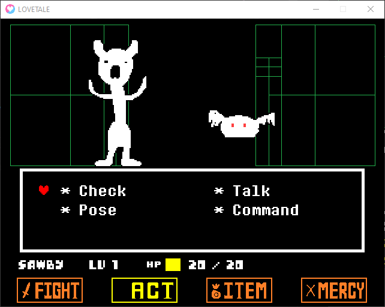
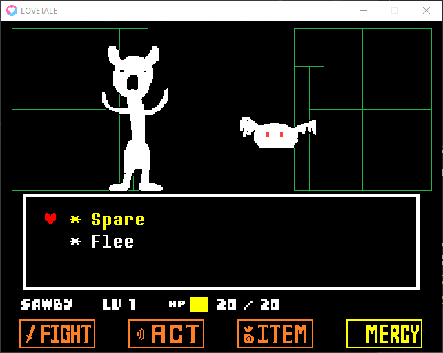
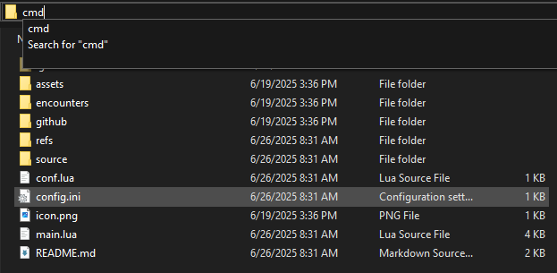

# LÖVETALE Engine

A learning project I'm doing that's a recreation of Undertale's battle system in LÖVE! This is mostly a personal project but you're more than welcome to use it yourself just as long as you credit me and excuse some unfortunate programming methods I've used!

## Controls
- Move - ↑←↓→ / WASD
- Confirm - Z / Enter
- Cancel - X / Shift
- Menu - C / Control
- Pause - Escape
- Fullscreen - F4 or F

These are customizable in the `config.ini` file

## Progress

This engine is still being worked on and is not finished. Here's a basic list of what is and isn't finished:

- FIGHTing is being worked on. Basic functionality is there but polish and accuracy improvements are needed. (Any help with this would be greatly appreciated!! Especially with coding in the enemy dust animation.)

- ACTing is completely finished.

- ITEMs are completely finished, besides item specific effects such as the Sea Tea's speed increase and item specific consumption sounds. I don't think these are important enough to work on right now, but later on I might work on putting those in.

- MERCY is completely finished, besides the particle effect that shows up when you spare an enemy.

- Enemy attacks have been started, but aren't a big priority until I've fully finished progamming FIGHTing. Things such as player damage and game over don't exist yet.

My overall progress estimation is ~70% completed. I hope to have this completely ready to use by Undertale's 10th year anniversary.

## Credits

I'm the only person working on this engine, but I used stuff from these cool people!

[92q6](https://github.com/92q6) - A friend of mine who I stole some code from. 
[Davidobot's post on the LOVE2D forums](https://love2d.org/forums/viewtopic.php?p=199030&sid=5e50e42e22e4538ca0f3f7b0717aa2f2#p199030) - FPS Limiter.  
[Toby Fox](https://x.com/tobyfox) - Developer of Undertale, also the composer of Stronger Monsters.  
[Temmie Chang](https://x.com/tuyoki) - Developer of Undertale.  

My Discord username is @sawby08 if you need anything or if you're willing to offer help!

## How to Run

I assume you already know how to do this but I thought I'd make these just in case! An easy way to run this engine is to:

- Install [LÖVE](https://love2d.org/)
- Zip the engine.
    - If you see an error talking about not being able to find main.lua, you didn't zip it correctly. Make sure main.lua is at the root of the .zip file.
- Change the file extention from .zip to .love.
- Double click the file.

The engine should now be running! Instructions for only avaliable for Windows and Linux because those are the only two OSes I have access to. Sorry!

Optionally, you can load the engine's directory in Visual Studio Code and run it through an extension. I use [this one](https://marketplace.visualstudio.com/items?itemName=pixelbyte-studios.pixelbyte-love2d).

### Windows

1. Open up the command prompt and set the directory as the directory of this engine.

    - An easy way to do this is to click on the directory entry on the top of the File Explorer and enter "cmd."

    

2. Run the command `"C:\Program Files\LOVE.exe" ./` (C:\Program Files\LOVE.exe can be wherever you installed LÖVE)

### Linux (Debian-based Distros)

1. Open up a terminal and install LÖVE: `sudo apt install love`
2. Go to the engines directory and run `love ./`

### Linux (Arch-based Distros)

1. Open up a terminal and install LÖVE: `pacman -S love`
2. Go to the engines directory and run `love ./`