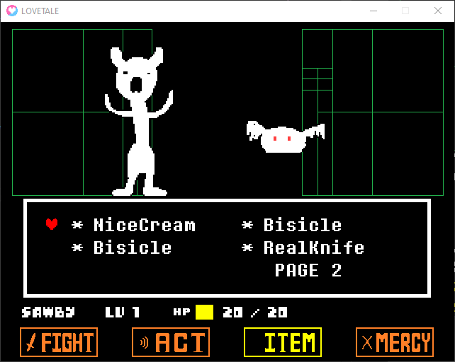
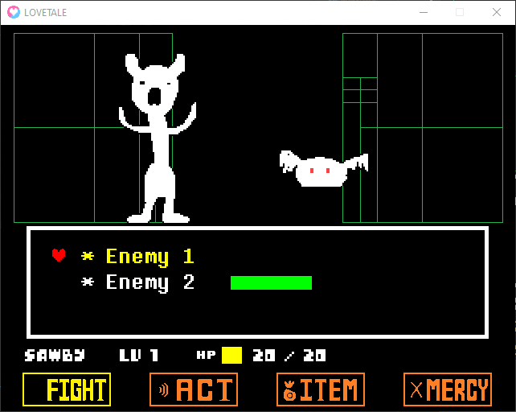

# LÖVETALE Engine

My third attempt at writing an Undertale battle engine in LÖVE with a goal of providing an easy framework for anyone to make their own accurate fanmade battles. Everything you need is in the "encounters" folder!

<iframe
    src="https://widgets.gamejolt.com/package/v1?key=DEoZvnZP" frameborder="0" width="500" height="245">
</iframe>

## Controls
- Move - ↑←↓→ / WASD
- Confirm - Z / Enter
- Cancel - X / Shift
- Menu - C / Control
- Pause - Escape
- Fullscreen - F4 or F

These are customizable in the `config.ini` file, as well as the enemy spare color, hitbox lenience, FPS, the usage of borders, and more.

## Progress

This engine is functionally complete, though some polish needs to be made.

- FIGHTing is completely finished.
    - Dusting effect has not been implemented yet. To be honest, I don't even know where to start with this.

- ACTing is completely finished.

- ITEMs are completely finished.

- MERCY is completely finished.
    - Sparing dust effect has not been implemented yet.

- Enemy attacks are completely finished.

My overall progress estimation is 95% completed. Again, this engine is techincally finished but I need to polish some things out.

## Credits

I'm the only person working on this engine, but I used stuff from these cool people!

[92q6](https://github.com/92q6) - A friend of mine who I stole some code from. 
[emir4169](https://github.com/emir4169) - Pull requests on my older engine that inspired some coding methods on this one  
[Toby Fox](https://x.com/tobyfox) - Developer of Undertale, also the composer of Stronger Monsters.  
[Temmie Chang](https://x.com/tuyoki) - Developer of Undertale.  

My Discord username is @sawby08 if you need anything or if you're willing to offer help!

## How to Run

I assume you already know how to do this but I thought I'd make these just in case! An easy way to run this engine is to:

- Install [LÖVE](https://love2d.org/)
- Zip the engine.
    - If you see an error talking about not being able to find main.lua, you didn't zip it correctly. Make sure main.lua is at the root of the .zip file.
- Change the file extention from .zip to .love.
- Double click the file.

The engine should now be running! Instructions for only avaliable for Windows and Linux because those are the only two OSes I have access to. Sorry!

Optionally, you can load the engine's directory in Visual Studio Code and run it through an extension. I use [this one](https://marketplace.visualstudio.com/items?itemName=pixelbyte-studios.pixelbyte-love2d).

### Windows

1. Open up the command prompt and set the directory as the directory of this engine.

    - An easy way to do this is to click on the directory entry on the top of the File Explorer and enter "cmd."

    

2. Run the command `"C:\Program Files\LOVE.exe" ./` (C:\Program Files\LOVE.exe can be wherever you installed LÖVE)

### Linux (Debian-based Distros)

1. Open up a terminal and install LÖVE: `sudo apt install love`
2. Go to the engine's directory and run `love ./`

### Linux (Arch-based Distros)

1. Open up a terminal and install LÖVE: `sudo pacman -S love`
2. Go to the engine's directory and run `love ./`